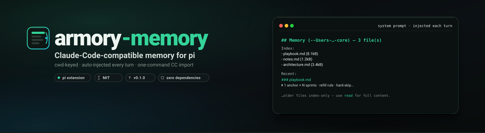

<p align="center">
  
</p>

<h1 align="center">armory-memory</h1>

<p align="center">
  <strong>Claude-Code-compatible memory, finally on pi.</strong> Every session auto-loads its project's memory — and you can import your whole Claude Code memory in one command.
</p>

<p align="center">
  <a href="https://www.npmjs.com/package/@getpipher/armory-memory"></a>
  
  
  
</p>

---

## The gap

Claude Code gives every session **automatic memory**: a session run in a repo passively loads that repo's memory (`~/.claude/projects/<cwd-slug>/memory/`) into its context — no skill to invoke, nothing to remember. **pi has no equivalent.** Files in `~/.pi/agent/memory/` are inert unless a skill explicitly reads them. So a CC→Pi migrant loses their memory entirely, and hand-written pi memory is invisible until wired up per-skill.

`armory-memory` closes that gap: pi gets the same passive, cwd-keyed memory CC has — **plus a one-command import** so you bring your whole CC memory with you.

| | survives across sessions | auto-surfaced in every session | CC-importable |
|---|:---:|:---:|:---:|
| pi (before) | ❌ | ❌ | — |
| **armory-memory** | ✅ | ✅ | ✅ |

## Install

```bash
pi install npm:@getpipher/armory-memory          # from npm
pi install git:github.com/getpipher/armory-memory # from git
```

Then restart pi (or `/reload`). Or add to `~/.pi/agent/settings.json`:

```json
{ "packages": ["npm:@getpipher/armory-memory"] }
```

## Bring your Claude Code memory (one command)

```bash
/memory import          # import EVERY CC project's memory (1:1, idempotent)
/memory import --force  # overwrite existing pi copies
/memory import --Users-rz-local-dev-core   # import a single project by CC slug
```

That's the on-ramp: install → `/memory import` → pi instantly remembers everything CC did. CC originals are **copied** (not moved), so you can run both hosts side-by-side during migration.

## How it works

- **Auto-injection** — on every `before_agent_start`, the current cwd's memory is injected into the system prompt as a `## Memory` block (mirrors CC's passive model). Budget-aware: a compact index of all files + the N newest inlined (capped), so your prompt never bloats even with hundreds of KB of memory.
- **cwd-keyed storage** — `~/.pi/agent/memory/<cwd-slug>/*.md`, exactly CC's scheme. Imports 1:1, muscle memory transfers.
- **`memory` tool** — model-callable; list the current cwd's memory.
- **`/memory` command** — human triage: `list` · `import [--force] [slug|all]` · `path`.

Full design + decisions: [`docs/memory-SPEC.md`](docs/memory-SPEC.md).

## Usage

**Passive** — you don't do anything. Once installed, every pi session starts with its repo's memory injected, just like CC:

```
## Memory (-Users-…-core) — 3 file(s)
Index:
- playbook.md (8.1kB)
- notes.md (1.2kB)
- architecture.md (3.4kB)

Recent:
### playbook.md
⏵ 1 anchor + N sprints · refill rule · hard-skip…

…older files index-only — use `read` for full content.
```

**Add memory** — drop any `*.md` into `~/.pi/agent/memory/<your-cwd-slug>/`. It auto-loads next session.

## Configuration

| env var | default | purpose |
|---|---|---|
| `ARMORY_MEMORY_ROOT` | `~/.pi/agent/memory` | override the memory root (tests / profiles) |
| `CC_PROJECTS_ROOT` | `~/.claude/projects` | override the CC source for import |

Store tests: `npm test` (25/25).

## Security

- Imported/memory files are `0600`. Memory is **local only** — never committed, never synced.
- **Never put secrets in memory.** Memory text is injected into the system prompt and therefore reaches your model provider — same rule as any context file.

## License

MIT.
